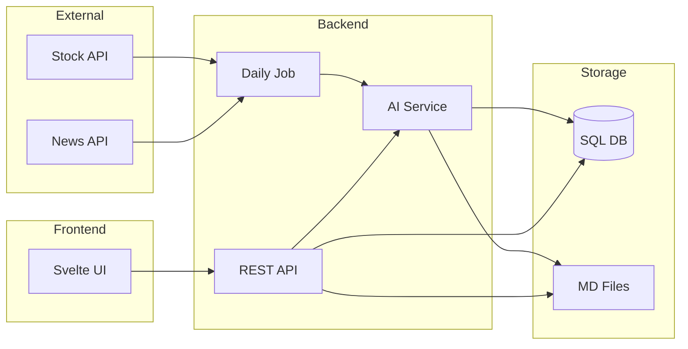

# Architecture & design

## Overview

StonksGPT is a monorepo: **backend** (Node.js REST API) and **frontend** (Svelte). The backend runs a daily job that fetches market data and news, loads your watchlist and recent context from the DB, calls an AI to produce recommendations, and stores the result in the database. The frontend shows the latest recommendation, lets you add manual notes, and browse history. All memory lives in the database so it survives redeploys (e.g. Dokploy).

## Architecture diagram



- **Repo layout:** Single repo with `/backend` (Node.js API) and `/frontend` (Svelte). Frontend calls backend REST API.
- **Backend:** Express, REST under `/api/*`, daily job (cron or HTTP-triggered), AI service, market-data router (Finnhub / Alpha Vantage / Swedish fallback), DB, optional MD write.
- **Frontend:** Svelte (Vite) – dashboard, manual notes form, history; UI is localized (en/sv), see [I18N.md](I18N.md).
- **Daily pipeline:** Job fetches market data + news, loads manual notes and last N recommendations from DB, builds prompt, calls AI, saves to `daily_runs` + `recommendations` (and optionally writes MD).
- **Storage:** PostgreSQL for watchlist, manual notes, runs, recommendations (canonical memory). Optional markdown under `backend/memory/daily/` for readability.

## Tech stack

- **Runtime:** Node.js 20+
- **Backend:** Express, Drizzle (Postgres), Vercel AI SDK (OpenAI / Anthropic / Google), Finnhub + Alpha Vantage clients, optional Yahoo .ST for Swedish.
- **Frontend:** Svelte + Vite.
- **Task:** [Task](https://taskfile.dev/) at repo root for install, dev, build, Docker, deploy.
- **Docker:** `docker-compose.yml` (Postgres + backend); backend has its own Dockerfile.

## Data model (SQL)

| Table | Purpose |
|-------|---------|
| **watchlist** | Symbols (and type: stock/etf/fund, exchange for routing). User-defined. |
| **manual_notes** | Free-text notes with optional date. Injected into daily prompt. Persisted in DB so inputs survive redeploys. |
| **daily_runs** | Timestamp, status, input snapshot (symbols, date). One row per run. |
| **recommendations** | Run id, **full raw AI output** (advice/reasoning) in DB, optional structured summary. DB is source of truth so previous advice is never lost on deploy. |
| **settings** | Optional key/value (e.g. overrides; API keys stay in env). |

**Persistence across deployments:** The app container is replaced on deploy; the filesystem is ephemeral. Postgres (volume or managed) persists. All memory—previous advice, user inputs, run history—lives in the DB. When building the daily prompt, we load “recent context” from the DB (last N runs + full recommendation text + manual_notes). MD files are optional (e.g. generated from DB or on a persistent volume).

## Core flows

1. **Daily recommendation**
   - Trigger: cron or `POST /api/jobs/daily`.
   - Load watchlist; route symbols: US → Finnhub, ex-US → Alpha Vantage, .ST → Alpha or Swedish fallback.
   - Fetch quotes and news (respecting rate limits).
   - Load recent context from DB (manual_notes, last N runs + recommendation text).
   - Call AI `generateText()` with prompt (long-term focus, disclaimer, output format).
   - Save to `daily_runs` + `recommendations` (full output in DB); optionally write `memory/daily/YYYY-MM-DD.md`.

2. **Manual note**
   - Frontend form → `POST /api/notes` → insert into `manual_notes`.

3. **Frontend**
   - Dashboard: latest recommendation (from DB), list of recent runs.
   - Form: add/edit manual notes.
   - History: list of days with link to recommendation (DB or MD).

## Project layout

```
/backend          Node.js API
  src/
    config/       API limits, env
    db/           Drizzle schema, migrations, seed
    routes/       REST: watchlist, notes, jobs, recommendations
    services/     AI service, market-data router, Finnhub/Alpha Vantage/Swedish clients, job runner
  memory/daily/   Optional MD files (gitignore or volume)
  Dockerfile
  .env.example

/frontend         Svelte (Vite)
  src/
    lib/          API client
    routes/       Dashboard, notes, history
  .env.example

/                 Root
  Taskfile.yml    task install, dev, build, docker:*, db:migrate, deploy
  docker-compose.yml   db + app
  README.md
  docs/           Architecture, data sources, AI/MCP, future plans
```

## Task (Taskfile)

All workflows run from repo root via [Task](https://taskfile.dev/):

- **Setup:** `task install` – install backend + frontend deps.
- **Development:** `task dev` (or `task dev:backend`, `task dev:frontend`).
- **Run:** `task run` → starts Docker stack (db + app).
- **Build:** `task build` – production build for backend + frontend.
- **Docker:** `task docker:up`, `task docker:down`, `task docker:build`.
- **DB:** `task db:migrate`, `task db:seed` (optional).
- **Deploy:** `task deploy` – build + build images (customize for Dokploy or your server).

Use `task <name>` in README and onboarding instead of raw `npm`/`docker-compose` so there is one consistent interface.

## Docker

- **Backend Dockerfile** (in `/backend`): Multi-stage; install deps, build, run Node (e.g. `node dist/index.js`).
- **docker-compose** (root): Service `db` (Postgres 16, volume); service `app` (backend, `DATABASE_URL` → db, env for API keys). Use `task docker:up` / `task docker:down`.

## Security and disclaimers

- API keys only in env; never in DB or MD.
- Add simple auth (e.g. API key or session) for `POST /api/jobs/daily` and write endpoints.
- Frontend and AI prompts include a disclaimer: recommendations are for informational purposes only, not financial advice.
